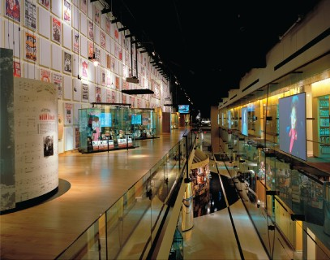
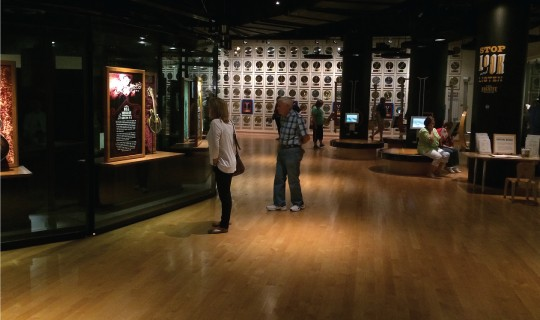
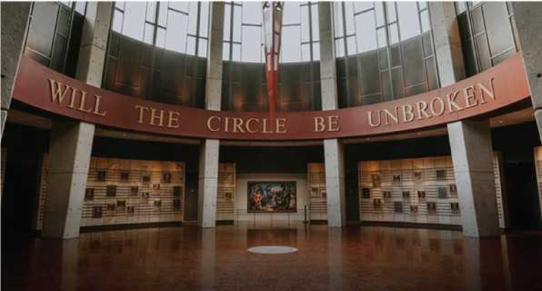

# Museum Interaction Geography

An interactive data visualization exploring how families move through, talk in, and engage with museum gallery spaces. The visualization displays **4 families (15 individuals)** visiting **3 gallery spaces** at a cultural heritage museum.

<p align="center">
  
  
  
</p>
<p align="center"><em>The three gallery spaces: Walkway, Bluegrass, and Rotunda</em></p>

---

## Features

- **Two views** -- Zoom into a single gallery or see all three spaces side by side
- **Three data modes** -- Movement paths, talk/conversation events, and curation engagement
- **106 conversations** with synchronized audio playback and transcripts
- Toggle individual family members, switch families and spaces, animate or freeze time

## Running Locally

Requires [Node.js](https://nodejs.org/) (v18+) and [Yarn](https://yarnpkg.com/).

```bash
yarn install
yarn dev
```

Open [http://localhost:5173](http://localhost:5173) in Chrome (recommended).

To build for production: `yarn build` -- outputs a fully static site to `build/`.

## Credits

Copyright (C) 2018 Ben Rydal Shapiro. All rights reserved.

Originally developed at Vanderbilt University as part of the dissertation [_Interaction Geography & the Learning Sciences_](https://etd.library.vanderbilt.edu/available/etd-03212018-140140/unrestricted/Shapiro_Dissertation.pdf).
